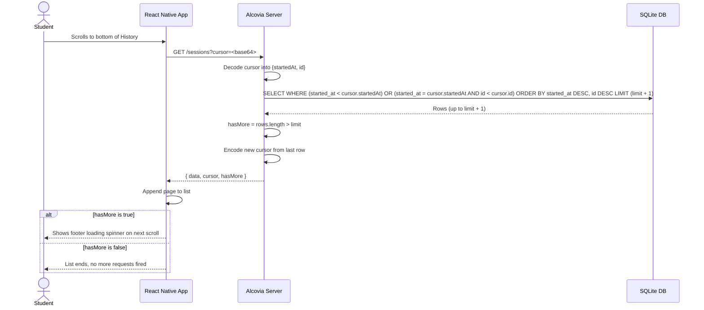
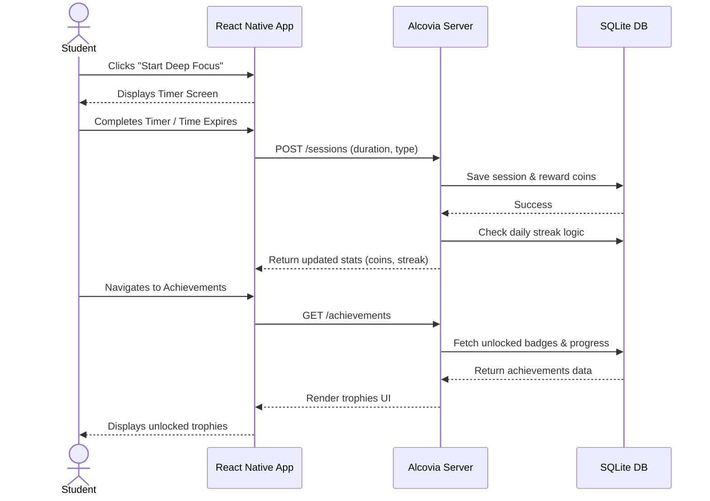

# Decisions

Here is the real reasoning behind the choices I made, not just what I built but why.

## State Management

- I used **TanStack Query** (`useQuery` and `useInfiniteQuery`) for anything that talks to the server.
- For local UI state, like the active filter tab or the selected achievement, I just used plain `useState`.
- The Timer screen needed clear, distinct states (idle, running, paused, completed), so I used `useReducer` there instead, since it models state transitions much better than scattered `useState` calls.
- I did not reach for Redux or Context because I did not actually have much global state to manage. What I needed was **caching**, **retry logic**, and **loading and error states**, and React Query gives all of that out of the box.

## API Integration

- The sessions list returns dates as **epoch milliseconds**, while the session detail returns them as **ISO strings**. This was intentional on the API side.
- Instead of writing a separate function to convert both formats, I used **dayjs()** everywhere, since it reads both formats natively without any extra conversion code.
- So every screen that displays a date just calls `dayjs(value)`, and it works correctly no matter which endpoint it came from.
- The tradeoff is that I am not resolving the inconsistency, I am letting the library absorb it. I left a comment in `types/api.ts` so this quirk stays documented for anyone reading the code later.

## Pagination

- I used **cursor-based pagination**, not offset-based. The cursor is a base64 encoded object holding `startedAt` and `id` from the last row of the current page.
- The `id` acts as a tiebreaker. If two sessions started in the exact same millisecond, sorting by time alone could skip or repeat a row. Adding `id` keeps the ordering fully stable.
- To check if there is a next page, I fetch one extra row (`limit + 1`) and check if it shows up, instead of running a separate count query.
- Once the user scrolls past the last page, `hasMore` returns false, and React Query simply stops fetching. The footer loader disappears and the list ends cleanly.
- Also one thing: I did not add an explicit "end of list" message.

I created a **pagination flow diagram** below for how a page request moves through the client, server, and database.

### Cursor-based pagination flow

## Edge Cases

- **API down:** shows a clear error message with a **Retry** button.
- **0 sessions:** shows an empty state with a short message and a button that leads straight into starting a new session.
- **Slow request (10 seconds):** this is a real gap. There is no timeout configured on the fetch calls, so a slow request just leaves the loading state active until it resolves or the network itself gives up.

## Session Detail

- No design was provided for this screen, so I built it around one core question: what actually happened in this session.
- I included the session type and icon, a completed or abandoned status badge, three key stats (**duration**, **coins earned**, **start time**), and a timeline bar showing the split between focus and break segments.
- I left out editing, deleting, and sharing. I wanted this screen to answer one question clearly instead of becoming a broader dashboard.
- I intentionally did not surface the end time (`completedAt`). Once duration and start time are visible, the end time is redundant information.

## What's Weak

- No timeouts or retry logic on slow requests, as mentioned above.
- The Timer only saves a session when it completes naturally. If someone closes the app mid-session, nothing is saved, even though the schema already has an **abandoned** status built for exactly this case.
- There is no authentication. The student id is hardcoded in `constants/config.ts`. Reasonable for an assignment, not production-ready.
- The Dashboard's progress ring had a text centering bug where the "3/3 sessions" label sat visually above center instead of centered in the ring, caused by hand-picked SVG text baseline coordinates instead of proper flexbox centering. Fixed by overlaying the label as a normal React Native `Text` component centered with flexbox, instead of positioning it inside the SVG.
- No manual "load more" fallback in case infinite scroll fails to trigger on some devices.
- With two more days, in order: fix the abandoned session gap, add request timeouts with retry, then replace the hardcoded student id with real authentication.

## What Breaks at Scale

- At 10,000 concurrent users, **SQLite** is the first thing to break, not the app logic itself.
- SQLite allows multiple simultaneous reads, but only one write at a time. Saving a session is a write, so under real traffic, that single write path becomes a bottleneck very quickly.
- The **stats endpoint** is the other weak point. Right now it runs **eight separate COUNT queries** per request (one for each day of the week, plus one for today), instead of a single grouped query. At low traffic this is invisible, but under heavy load it multiplies read pressure on the database for no real benefit.
- On top of that, there is only one server instance running, with no load balancing or backup servers.
- What I would change first: move to a database like **Postgres** that handles concurrent writes properly, rewrite the stats route as one `GROUP BY` query instead of eight, and add caching on read-heavy routes like stats.

---

## (Bonus) Achievements Screen

- No design was given for this screen either, only the data shape and 12 achievement names, so the layout is entirely my own.
- The top of the screen has a gradient hero card with an animated percentage and a progress ring showing overall completion.
- Below that is a horizontal **Recently Unlocked** rail, followed by separate Unlocked and Locked sections in a grid layout.
- Locked badges get a small lock icon and slightly reduced opacity, rather than a fully grayed-out look, so people can still see what they are working toward.
- Tapping any badge opens a bottom sheet. Locked ones show a progress bar with numbers, unlocked ones show the actual unlock date.
- I reused the same glow animation from the Focus Timer on these badges, so both screens feel like they belong to one connected app.

## (Bonus) Focus Timer

- I have built a similar focus and study tracking flow before on **Kraked**, my own real-time collaborative study platform, so I already had a sense of what makes a timer feel usable versus mechanical. That experience shaped some of the decisions here, especially around keeping Focus and Pomodoro as clearly separate modes rather than blending them.
- No design spec was given, so I designed the full flow myself: pick a session type, pick a duration, then move to a running screen with a countdown ring and pause/resume controls.
- The countdown is based on comparing the current time against a fixed end time, rather than counting down second by second. This keeps it accurate even through brief stutters, since it always recalculates from the real clock instead of accumulating ticks.
- What I intentionally left out: true Pomodoro-style automatic focus and break cycling. Right now, every session type, including Pomodoro, saves as a single focus block.
- I also did not build persistence for a session interrupted mid-way. Given the time limit, I prioritized one clean, fully working flow over a partially working cycling timer.

---

## Diagrams

### Session completion flow

This covers what happens from the moment a student finishes a Deep Focus session to seeing it reflected in Achievements.

