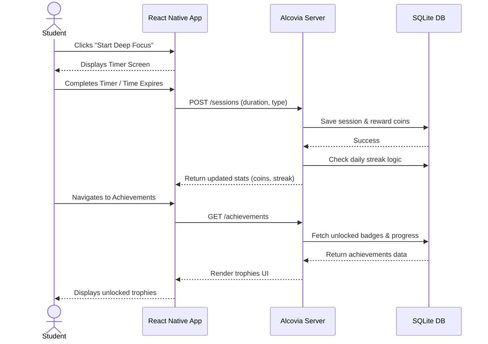
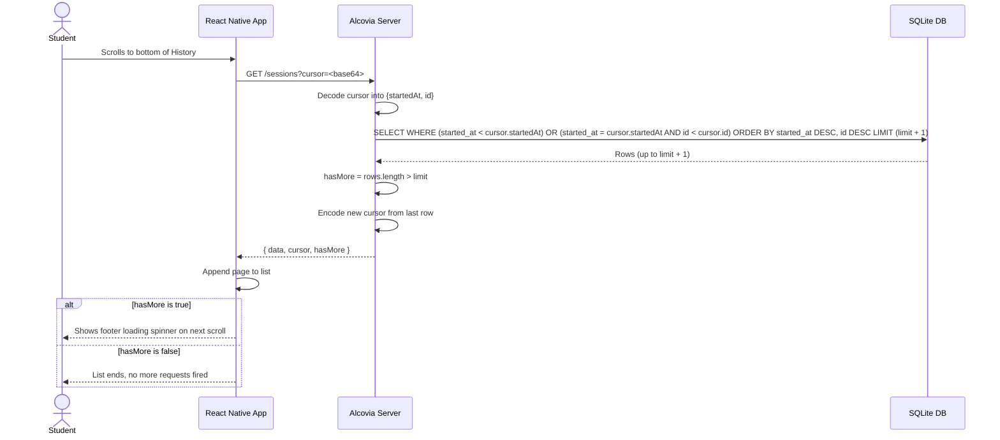

# Alcovia Student App - Assignment

You're building screens for a student focus app, the API that powers them, and optionally an automation workflow. A design spec, starter code, and seed data are provided. What you build on top of them is your call.

---

## What's in this submission

**Core requirements:** all done, Dashboard matches the design spec, History and Session Detail handle loading, empty, error, and pagination states.


### Checklist

**Mobile app (React Native / Expo)**

- [x] Dashboard — fully specced, matched closely
- [x] History — empty, loading, error, and pagination states handled
- [x] Session Detail — no spec given, built from scratch

**Backend API (Express + SQLite)**

- [x] `GET /students/:id`
- [x] `GET /students/:id/sessions` (cursor-based pagination + filters)
- [x] `GET /students/:id/sessions/:sessionId`
- [x] `GET /students/:id/stats?period=week`
- [x] Cursor-based pagination (not offset)
- [x] Date format inconsistency handled (epoch ms on list, ISO on detail)
- [x] Input validation and error handling

**Bonus challenges (2 needed, 3 completed)**

- [x] **B1. Focus Timer**
- [x] **B2. Achievements Screen**
- [ ] B3. n8n Streak Workflow — not attempted
- [ ] B4. Tests — not attempted
- [x] **B5. Animations & Polish**

Full reasoning for every decision, including tradeoffs and known weak spots, is in **[DECISIONS.md](./DECISIONS.md)**.

### How data flows: session completion → achievements



### How pagination works



### One note on setup

`API_BASE_URL` in `constants/config.ts` auto-detects the dev machine's LAN IP from Expo's Metro bundler at runtime, no manual IP editing needed. Just make sure your phone (or emulator) and the machine running `npm run dev` are on the same network.

---

## Original assignment brief

The rest of this file is the assignment as given, kept for reference.

## Core Requirements

Everyone must complete these. This is what you're evaluated on.

### 1. Mobile app (React Native / Expo)

| Screen         | Spec level            | What this means                                                                  |
| -------------- | --------------------- | -------------------------------------------------------------------------------- |
| Dashboard      | **Fully specced**     | Design reference has exact measurements, colors, spacing. Match it closely.      |
| History        | **Partially specced** | Happy path is designed. Empty, loading, error, and pagination states are on you. |
| Session Detail | **No spec**           | Tapping a session in History should go somewhere useful. Figure out what.        |

### 2. Backend API (Express + SQLite)

The database schema, seed script, and fixture data are provided in `server/`. You build the route handlers for these endpoints (documented in `API-SPEC.md`):

- `GET /students/:id`
- `GET /students/:id/sessions` (with cursor-based pagination and filters)
- `GET /students/:id/sessions/:sessionId`
- `GET /students/:id/stats?period=week`

Pay attention to:

- Cursor-based pagination (not offset)
- The date format inconsistency between the sessions list and session detail endpoints (this is intentional, read the spec)
- Input validation and error handling

### 3. Documentation

- **DECISIONS.md** - fill in every section with your actual reasoning. This matters as much as the code.
- **Video demo** - 2-3 minute screen recording walking through your app. No narration required, but explain anything non-obvious.

---

## Bonus Challenges

These are optional. Complete any 2 or more and you're **guaranteed an interview**, regardless of how polished the core is.

### B1. Focus Timer

Build a Focus Timer screen accessible from the Dashboard's "Start Session" button. There is no design for this - you decide everything: timer UI, session type selection, pause/resume, and what happens when a session completes. Must POST to the `POST /students/:id/sessions` endpoint on completion.

### B2. Achievements Screen

Build the Achievements tab from the wireframe. You get the data shape and 12 achievement names. Everything visual is your decision: layout, locked vs unlocked treatment, progress visualization, animations. Must use `GET /students/:id/achievements`.

### B3. n8n Streak Workflow

When a student completes their daily goal (3 sessions), fire a webhook to an n8n workflow. Set up an n8n instance (local Docker or n8n.cloud free tier), create a workflow that does something useful with the notification, and make it idempotent (same student + same day = 1 notification). Payload documented in `API-SPEC.md`.

### B4. Tests

Write tests for your API. At minimum: pagination logic (cursor encoding/decoding, hasMore flag, edge cases) and the date format handling (epoch ms on list, ISO on detail).

### B5. Animations & Polish

Meaningful transitions between screens, skeleton loading states (not spinners), haptic feedback, or micro-interactions that make the app feel native.

---

## What's provided

```
├── app/                    # Expo Router app with tab navigation
│   ├── _layout.tsx         # Root layout, fonts loaded
│   ├── (tabs)/
│   │   ├── _layout.tsx     # Tab bar configured
│   │   ├── index.tsx       # Dashboard placeholder
│   │   ├── history.tsx     # History placeholder
│   │   └── achievements.tsx # Achievements placeholder
│   └── session/
│       └── [id].tsx        # Session detail placeholder
├── constants/
│   └── Colors.ts           # Design tokens (colors, shadows, radii, spacing)
├── types/
│   └── api.ts              # TypeScript types for all API responses
├── server/
│   ├── src/
│   │   ├── index.ts        # Express boilerplate
│   │   ├── db.ts           # SQLite schema + connection
│   │   └── seed.ts         # Seed script
│   └── fixtures/           # JSON seed data
├── API-SPEC.md             # Endpoint reference
├── DECISIONS.md            # Fill this in (required)
└── designs/
    └── design-spec.html    # Open in browser for the visual reference
```

## Getting started

```bash
# Mobile app
npm install
npx expo start

# Backend (separate terminal)
cd server
npm install
npm run seed
npm run dev
```

## How to submit

You'll receive a submission form link in the assignment email. You'll need:

1. Your GitHub repo link (public or invite @VibhorGautam)
2. Video demo link (Loom, Google Drive, or YouTube)
3. Which bonus challenges you completed

## What we're evaluating

We care about decisions more than polish. A thoughtful app with rough edges beats a pixel-perfect app that doesn't handle edge cases.

Specifically:

- How closely you match the design spec (Dashboard)
- How you handle states the spec doesn't cover (loading, empty, error, pagination)
- How you deal with the intentional API quirks (date formats, cursor pagination)
- The quality of your DECISIONS.md answers
- Code organization and TypeScript usage

## Rules

- You can use any libraries you want
- You can restructure the starter code however you see fit
- AI tools are fine to use, but your DECISIONS.md and video demo should reflect your own understanding
- If something in the spec seems wrong or ambiguous, make a call and document it in DECISIONS.md
